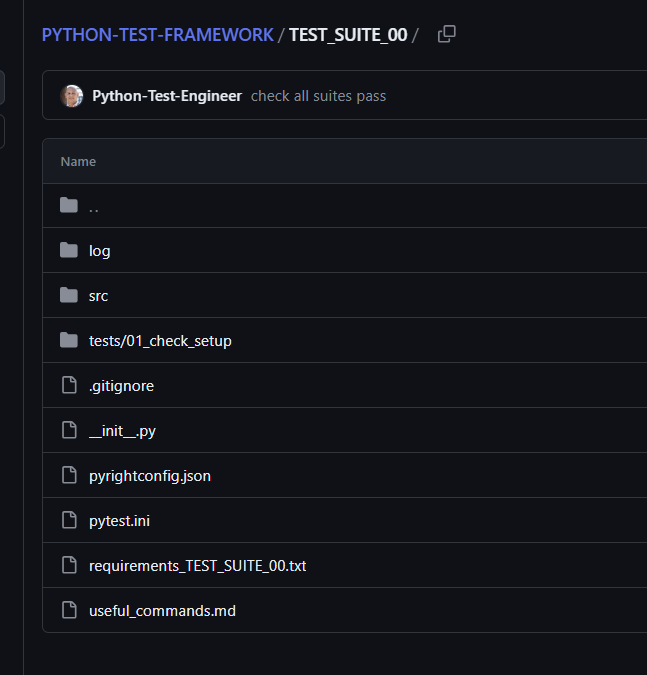

# PyTest Basic


## Set up


This uses TEST_SUITE_00 and is a simple wiring of src folder for your code and an tests folder for PyTest.

{:style="width:520px;border-radius:10%;border: 5px solid #555;"}

There is custom logging defined in pytest.ini that outputs to a `log` folder.

- move to `TEST_SUITE_00` folder and 
```
pip install -r requirements_00.txt
```


## Sample layout

```bash
├── docs
│   ├── about.md
│   └── index.md
├── mkdocs.yml
└── site
    ├── 404.html
    ├── about
    │   └── search_index.json
    ├── sitemap.xml
    └── sitemap.xml.gz

```

## Tests

pytest-sugar has been installed to provide prettier console output.

```
python -m pytest 

python -m pytest -vs
```

👉 [Click me to download zip](https://github.com/peaceiris/mkdocs-material-boilerplate/archive/main.zip)
